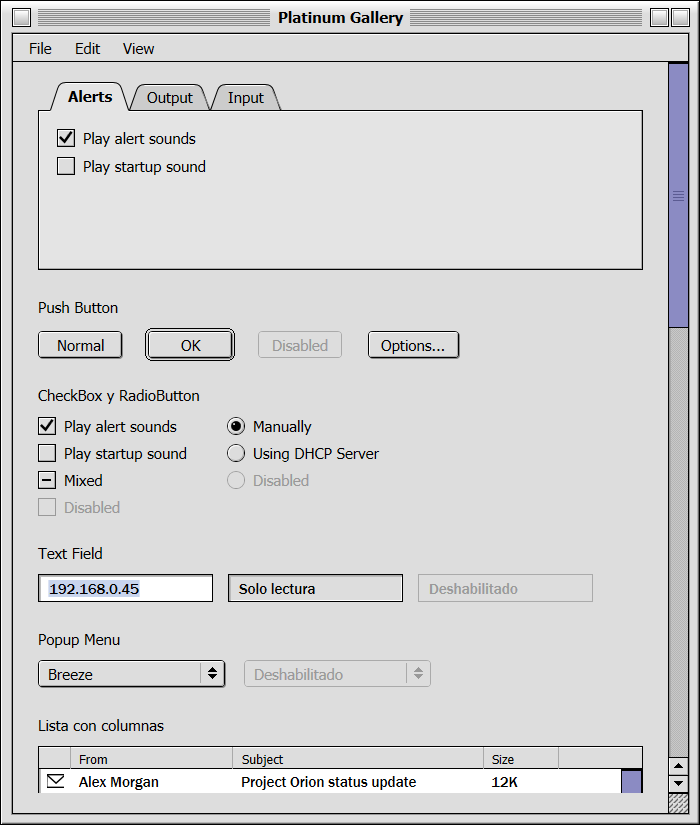
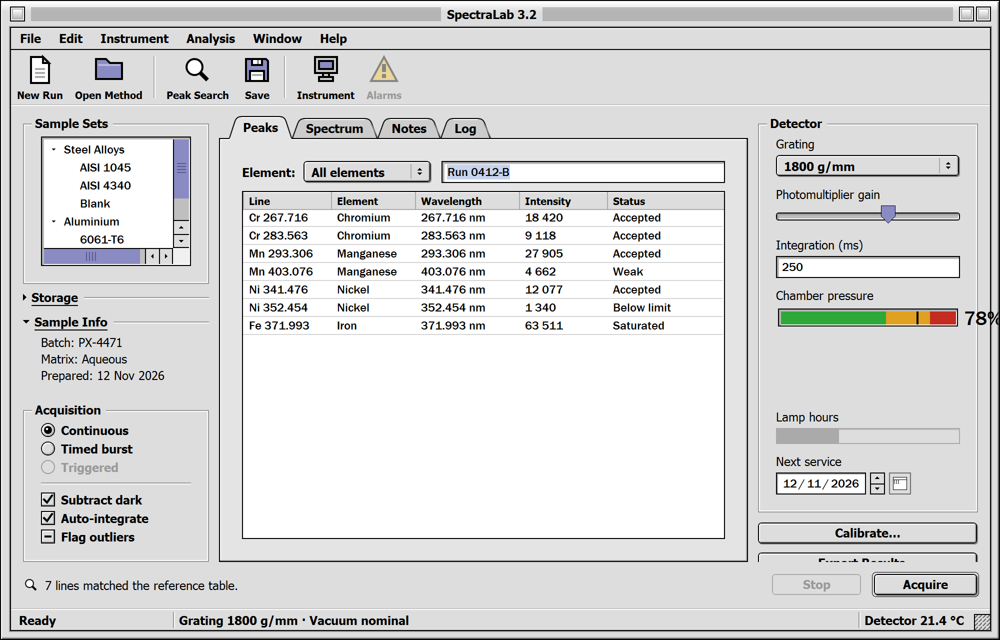
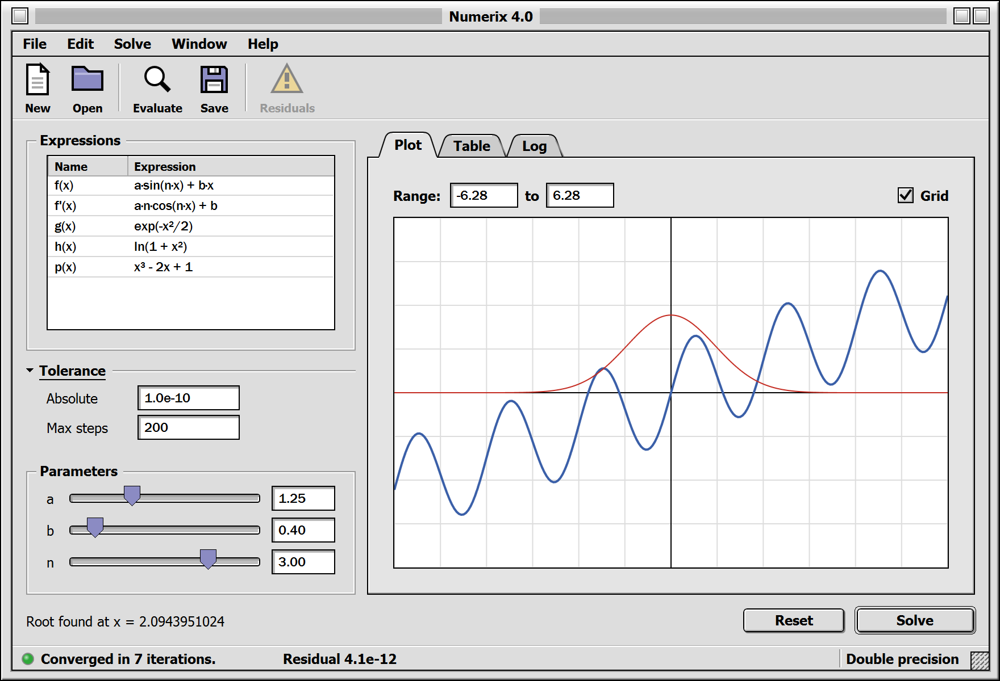
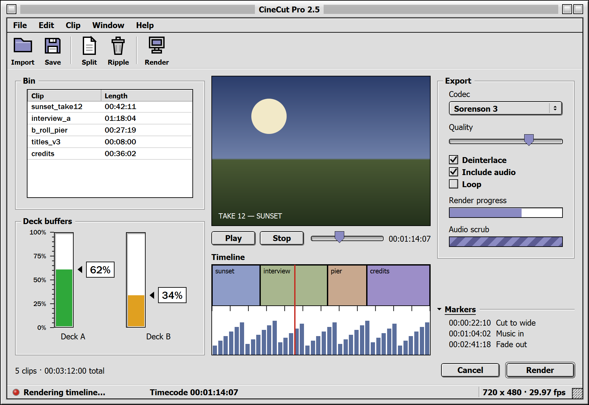
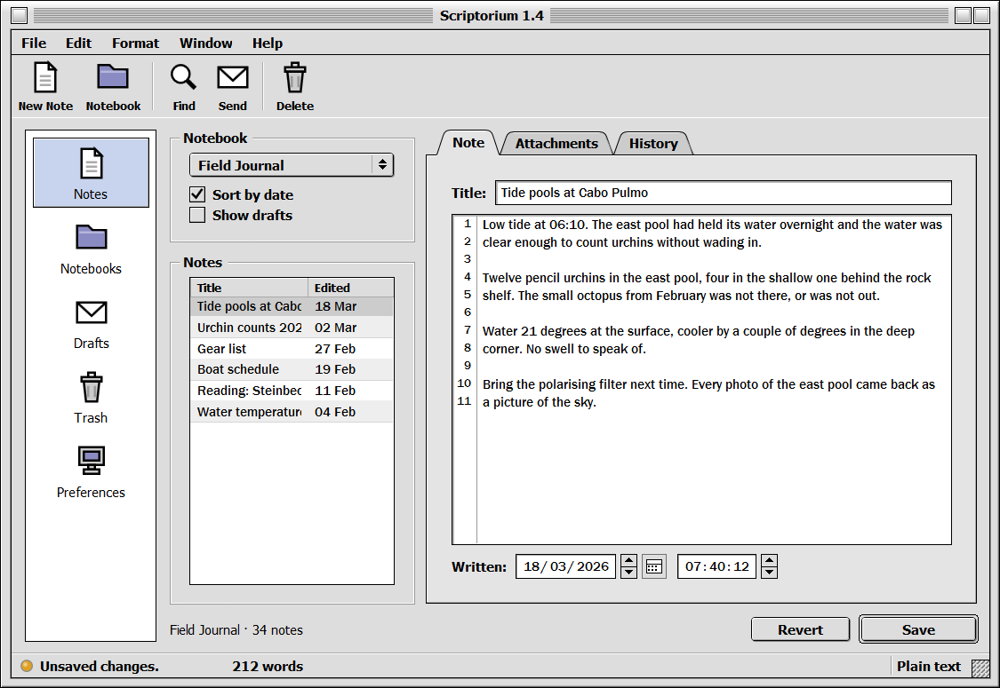

# MacOS9.Platinum

A WPF control library with the look of the Mac OS 9 Platinum interface.



*Every image below is a real screenshot of the gallery application, not a mock-up.
The four programs are invented — a spectrometer console, a solver, a video editor
and a notebook — and they exist only to put the controls in situations a strip of
samples never reaches: a list next to a plot, a toolbar over a rail, a text area
that has to share its well with a line gutter.*

**SpectraLab** — the spectrometer console. Menus, toolbar, tree, column list, tabs,
sliders, progress bars, a date field and the status bar. Some controls live in its
dialogs on purpose: a modal sheet is where radio groups, password fields and
indeterminate progress bars actually show up.



**Numerix** — the solver. The same chrome around a drawn plot, with an expander,
parameter sliders paired to fields and a green status light.



**CineCut** — the video editor. A hand-drawn timeline under the theme's chrome, an
indeterminate bar for the audio scrub and a red light while it renders. The two
deck buffers are live: a timer walks the real values, so the level meters move and
change colour as they cross a threshold. Nothing animates the control — the value
changes, as it would in a real application, and the meter redraws.



**Scriptorium** — the notebook. The navigation rail on the left, the line-number
gutter sharing one sunken well with the text, and a date and time field with
seconds.



Run any of them with `dotnet run --project src/MacOS9.Platinum.Gallery -- math`
(`math`, `video`, `notes`, or nothing for SpectraLab).

There is also a browsable catalogue in [docs/componentes.html](docs/componentes.html),
with every control broken down by state and the file it lives in. That one *is* a
CSS re-creation: treat it as an inventory, not as proof of how things render.

## Layout

| Project | What it is |
|---|---|
| `src/MacOS9.Platinum` | The library: resource dictionaries and custom controls |
| `src/MacOS9.Platinum.Gallery` | SpectraLab, a fictional spectrometer console that exercises every control, with three dialogs |

## Usage

The consuming application merges a single dictionary:

```xml
<Application.Resources>
    <ResourceDictionary Source="/MacOS9.Platinum;component/Themes/Platinum.xaml" />
</Application.Resources>
```

That is enough for every `Button`, `CheckBox`, `RadioButton`, `TextBox`, `ComboBox`
and `ScrollBar` to take on the Platinum look without touching existing markup.

For the window chrome, use the `PlatinumWindow` control instead of `Window`:

```xml
<platinum:PlatinumWindow
    xmlns:platinum="clr-namespace:MacOS9.Platinum.Controls;assembly=MacOS9.Platinum">
```

### Menus that drop to the left

Windows has a setting, `MenuDropAlignment`, that aligns menus to the right of the
pointer. It is commonly on for left-handed setups, and WPF honours it inside
`MenuItem` itself: no combination of `Placement`, `PlacementTarget` or
`FlowDirection` changes it, because the flip is applied afterwards. The result is
a menu sheet that opens away from its title and off the window.

`PlatinumWindow` fixes this in its static constructor, so an application that uses
the theme's window gets it for free and has nothing to call. The fix lives there
and not in the dictionary because constructing the theme's window is an explicit
act while merging a `ResourceDictionary` is not.

If you use a plain WPF `Window` and only merge the dictionary, call it yourself
before showing the first window:

```csharp
MacOS9.Platinum.PlatinumTheme.UseLeftMenuDrop();
```

It overrides a user preference, so there is a way out. Call this before the first
`PlatinumWindow` is created and Windows keeps deciding:

```csharp
MacOS9.Platinum.PlatinumTheme.KeepSystemMenuDropAlignment();
```

### One integration requirement

WPF ships two engines for painting text selection. The older one draws it as an
adornment on top of the text, so an opaque highlight hides the glyphs. Turn it off
during application start-up, before the first window is shown:

```csharp
AppContext.SetSwitch(
    "Switch.System.Windows.Controls.Text.UseAdornerForTextboxSelectionRendering",
    false);
```

This cannot be handled from a `ResourceDictionary`: it is a process-wide switch.

## Controls

- **PlatinumWindow** — pinstriped title bar, close/zoom/collapse box, grow box,
  three-layer frame, windowshade, maximise bounded to the work area
- **Button** — normal, default (with its ring), pressed, disabled
- **CheckBox** and **RadioButton** — checked, unchecked, indeterminate, disabled
- **TextBox** — editable, read-only, disabled, with opaque selection
- **PasswordBox** — the same sunken well as the text field; separate file because
  `PasswordBox` does not derive from `TextBoxBase` and shares no template with it
- **ComboBox** — popup menu with arrows, and drop-down menu
- **ScrollBar** — vertical and horizontal, arrows grouped at the end of the track,
  channel with a checkerboard texture snapped to physical pixels, disabled state.
  The frame is bound to `BorderThickness`, so a host that already closes an edge
  can switch off that side and avoid two rules stacking into one thick line
- **TabControl** — trapezoidal tabs, the active one fused with the panel
- **ListView** — list with columns: embossed headers, row dividers anchored to the
  bottom of each row so the last one is closed too, full-row selection, and a
  dedicated template for the GridView `ScrollViewer`
- **Menu** and **ContextMenu** — menu bar with submenus, checkable items, keyboard
  gestures and separators; inverted blue highlight, the only one in the theme
- **Slider** — horizontal and vertical, with tick marks; the thumb pentagon is
  rasterised to physical pixels
- **GroupBox** and **Separator** — engraved two-tone line with the title breaking
  it; separator aliases for `ToolBar` and `StatusBar`
- **ToolBar** and **PlatinumToolButton** — the icon strip under the menu bar: a
  large icon over a label, no frame until the pointer arrives, engraved vertical
  separators between groups. The button takes `Icon` and `Text` as properties
  rather than hand-assembled content, so every label in a bar lines up. The bar
  drops WPF's overflow button on purpose: a Mac OS 9 toolbar never rearranged
  itself, what does not fit is clipped
- **PlatinumLineGutter** — the numbered strip beside a text area. It points at a
  `TextBox` through `Target` instead of wrapping it, so the box stays the themed
  one — frame, selection and scrollbar included — and the strip only reads
  positions. Lines are counted the way the box counts them, one number per drawn
  row, because the number marks a place on screen. `PlatinumWellChrome` and
  `PlatinumTextBoxPlain` are there to put both inside a single sunken well
- **Expander** — a collapsible section: the Finder disclosure triangle, an
  underlined title, and the engraved rule carrying on to the right edge. The whole
  header row toggles it, not just the triangle, and it snaps open with no
  animation — the original had none, and a slide gives the theme away at once
- **Navigation rail** (`PlatinumNavRail` + **PlatinumNavItem**) — the left column of
  large icons that switches panels. It is a `ListBox` style plus a `ListBoxItem`
  subclass, so selection and keyboard travel come free. Unlike every other list in
  the theme, the selected entry does *not* dim when focus leaves: the mark says
  which panel is on show, and that does not change because the cursor went
  elsewhere
- **PlatinumLevelGauge** — a level meter: a sunken track that fills, with a
  graduated scale, a caret and a boxed readout. The colour bands are declared by
  the application as a collection, not baked in as good/warning/bad, because the
  control cannot know whether more is better — a full buffer is good, a high
  occupancy is not — and because not every meter has three states. Two readings:
  `Fill` puts the level in the filled area and colours it by the band it lands in;
  `Zones` paints the bands as a fixed scale over the whole track and marks the
  value, so the thresholds are visible without reading a legend. The legend itself
  is not part of the control: its words belong to the application's domain. The
  track reuses the text field's sunken well, down to the two shadow tones, so a
  meter beside a field reads as the same window
- **PlatinumLed** — the little status light. Colour and on/off are separate
  properties because they say different things: the colour is what the light is
  about, the flag is whether it is lit. Off it goes grey rather than vanishing, so
  you can still see the light is there and unlit. The gloss is translucent white,
  not a second colour, so any tint works without declaring a palette per colour
- **StatusBar** — the strip along the bottom edge of a window: window face, an
  engraved rule separating it from the content, and cells that dock to either
  side while the last one takes the remaining width
- **TreeView** — tree with disclosure triangles and Finder indentation
- **ProgressBar** — determinate, indeterminate (diagonal stripes), vertical and
  disabled
- **PlatinumStepper** — the little arrows: a stacked pair of repeat buttons that
  raise `Stepped` with a direction. It holds no value of its own, so it works for
  anything, which is how the system treated it
- **PlatinumDateTimeField** — date or time split into parts. Click a part or walk
  with left/right, then change it with up/down, with the little arrows, or by
  typing digits; a full part rolls over to the next one. There is no free-text
  entry on purpose: a half-typed invalid date cannot exist, which is the problem
  this control solves and a text box does not. Three modes: `Date`, `Time`
  (12-hour with AM/PM) and `TimeWithSeconds` (24-hour hh:mm:ss — a field that goes
  down to the second is measuring a duration or an exact instant, and there the
  meridiem gets in the way). The calendar button switches itself off in the time
  modes rather than having to be switched off at every use
- **PlatinumCalendar** — one month: the month as a drop-down menu and the year as a
  field with its little arrows, which is how you jumped a year without stepping
  through twelve months. It draws only the weeks the month actually occupies, and
  days from the neighbouring months are left blank so the month on show reads at a
  glance
- **ToolTip** — the yellow help note from Mac OS 9
- **PlatinumAlert** — the modal every application needs: icon on the left, message
  and optional detail on the right, buttons at the bottom with the ring on the
  default one. `PlatinumAlert.Show(owner, title, message, detail, kind, buttons)`
  returns which button closed it. Button captions are properties, so the library
  imposes no language
- **Icons** — ten 16×16 vector icons (folder, document, floppy, disk, trash, alert,
  info, envelope, computer, magnifier) in `Themes/Icons.xaml`

### Details that layout alone cannot solve

Several pieces are drawn by measuring the physical pixel instead of leaving them to
the layout system, because WPF rounds each edge independently and on a scaled
display the result comes out asymmetric or blurry:

| Piece | File |
|---|---|
| Title bar pinstripe | `Controls/Pinstripe.cs` |
| Default button ring | `Controls/DefaultRing.cs` |
| Arrow and disclosure triangles | `Controls/ArrowGlyph.cs` |
| Scrollbar channel checkerboard | `Controls/CheckerTexture.cs` |
| Slider thumb pentagon | `Controls/SliderThumbShape.cs` |

Tabs (`Controls/TabShape.cs`) are the deliberate exception: their diagonals and
curves need anti-aliasing, so they are drawn as vectors and only the straight runs
are snapped to the grid, the same way `Border` does for buttons. Their outline is
one logical unit rounded to whole pixels — one at normal scale, two at 200% —
because a pen fixed at one physical pixel left the tab with half the stroke of
every other frame in the theme, all of which come from a `BorderThickness` of one.

The theme also sets `TextOptions.TextFormattingMode="Display"`, because WPF's
`Ideal` mode positions stems on fractional pixels, and at 11 px a one-pixel stroke
gets spread across three columns.

## Typography

Platinum uses Charcoal for chrome and Geneva for content. Neither exists on Windows,
so the theme substitutes Tahoma for Charcoal and Franklin Gothic Medium for Geneva.
The split is a rule of the theme: every control that displays user data uses
`ViewFontFamily`, and everything that is chrome uses `SystemFontFamily`.

## Building

```
dotnet build MacOS9.Platinum.slnx
dotnet run --project src/MacOS9.Platinum.Gallery
```

Requires .NET 9 or later with the Windows desktop workload.

## Verification

The checks live in [tools/](tools/), outside the solution because they are not part
of the library:

```
pwsh -File tools/check-resources.ps1
pwsh -File tools/check-parts.ps1
pwsh -File tools/check-render.ps1
dotnet run --project tools/Probe
```

`check-resources.ps1` checks that every `{StaticResource}` resolves against the keys
its own dictionary can reach, that no `TargetName` points at a missing `x:Name`, and
that no key is defined twice. None of that fails at compile time: a `StaticResource`
inside a `ControlTemplate` is resolved when the template is instantiated, so a
misspelled key in the submenu branch brings the application down the first time
somebody opens that submenu, not at start-up.

`check-parts.ps1` checks that every `PART_` the stock WPF templates declare also
exists in ours. A custom template replaces the stock one wholesale, and the control
looks its pieces up by name: a missing `PART_` silently takes with it whatever
behaviour hung off that piece. Nothing fails to compile and nothing throws. It
happened here — without `PART_HeaderGripper` the library lost both column resizing
and double-click-to-fit, and nobody noticed until a user asked for them as if they
were a new feature. The stock templates under `tools/StockTemplates/stock` are
regenerated with `dotnet run --project tools/StockTemplates`.

`check-render.ps1` renders every scenario and compares it against an approved
image, failing on any pixel that changed. The defects in this theme are one pixel
wide — a rule painted twice, a border that spills, one shadow too many — so the
only detector used to be a person looking at screenshots. Anti-aliased diagonals
drift by a fraction of a pixel between runs, so a small soft-difference budget is
tolerated while any hard jump fails; the thresholds are chosen so a doubled 1px
rule still fails loudly. Approving (`-Aprobar`) is meant to be deliberate: look at
the image, then accept it.

`Probe` instantiates every template and style in the theme — which forces WPF to
resolve them — and renders each control with `RenderTargetBitmap` into
`tools/Probe/bin/.../render`. It opens no window and never touches the desktop, so
it is useful for states a screenshot cannot reach: disabled, overflowing content,
a rolled-up window, extreme widths. Switching `dpiAware` to `false` in
`app.manifest` and rebuilding produces the 100% case.

### Measuring instead of eyeballing

Visual defects in this library are settled by sampling pixels, not by opinion. The
recurring cause is two elements painting the same place: if an edge looks twice as
thick, look for the second owner rather than adjusting the neighbour. Capture the
window, profile the row or column across the defect, name the colours, fix the
element that paints too much, then profile the same cut again.

When a defect is structural, dumping WPF's own stock template answers "how does the
framework solve this by default?" in seconds. That is how the doubled scrollbar edge
was traced: the stock `GridView` scroll viewer draws no frame around the scrollbar
at all, because the frame belongs to the list and there is exactly one owner.

## Licence

MIT. You may clone, modify, use and redistribute the library, including in
commercial projects; the only requirement is that you keep the copyright notice.
The full text is in [LICENSE](LICENSE).
